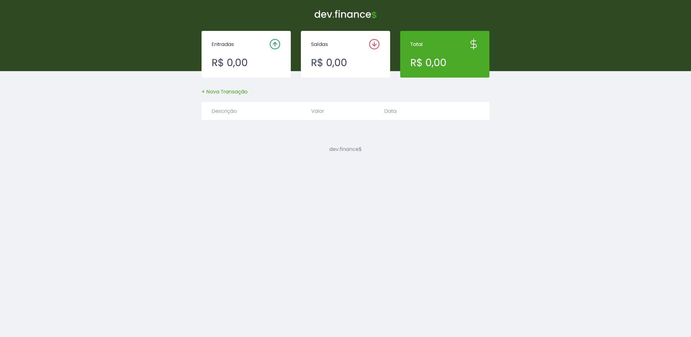
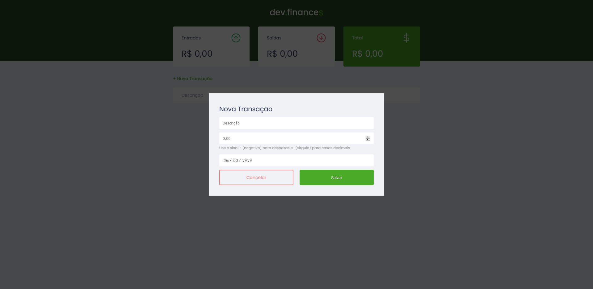

# Maratona Discover

Foi um evento ministrado pelo instrutor [Mayk Brito](https://github.com/maykbrito), da [Rockeseat](https://rocketseat.com.br), que objetiva criar uma base de conhecimentos sobre as tecnologias **HTML5**, **CSS3**, e **JavaScript**.

---
**Página:** *início*

---

**Página:** *início com modal para adicionar valores*

---

**Página:** *início com valores inseridos*

</> Feito por: [hitnnan](https://github.com/hitnnan)

---
## Como ver e usar o projeto em sua máquina:
    Clone o repositório:
    git clone https://github.com/Hitnnan/maratona-discover.git

    Abra o arquivo index.html